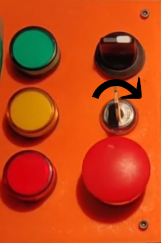
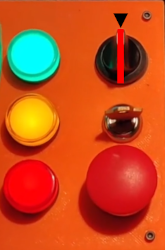
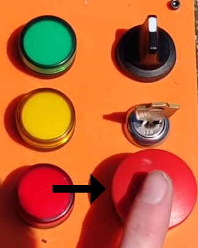

Getting Started
================

Assembling the Controller
--------------------------
1. Print the enclosure
2. Glue the corners onto the enclosure
    ![Enclosure corner placement][corner-placement]
3. Wire electronic components together according to the wiring diagram
    ![Wiring diagram][wiring-diagram]
4. Put the electronics in the enclosure
5. Screw the lid onto the enclosure

Using the Controller
---------------------
1. Make sure that the launch ignition box is armed & ready and everyone is a safe distance away from the launch pad
2. Power on the launch controller by turning the key switch in the clockwise direction

    

3. Turn the black arming switch to the upward position in order to arm the system; once a connection to the launch ignition box has been established, the safety siren on the launch ignition box should activate

    

4. Press the large red button to launch the rocket when ready

    

<!-- Links -->
[corner-placement]: ./images/corner_placement.png "Enclosure corner placement"
[wiring-diagram]: ./images/wiring_diagram.png "Wiring diagram"
